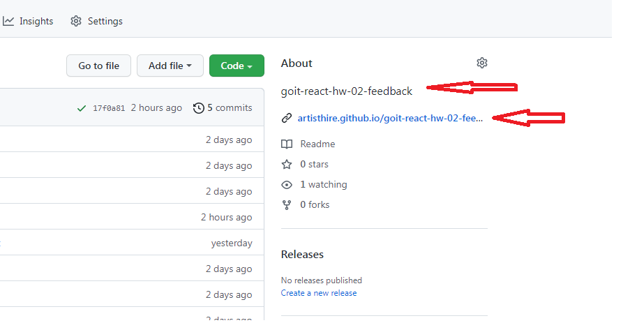

# React homework my template

Этот проект был создан при помощи
[Create React App](https://github.com/facebook/create-react-app).

## Подготовка нового проекта

1. Изменить "name" в package.json на название проекта из ДЗ (например,
   goit-react-hw-02-feedback).
2. Выполнить "npm install" для установки всех зависимостей.
3. Создать на github новый репозиторий с названием проекта из ДЗ, таки же как в
   п. 1.
4. Выполнить привязку репозитория и первый push на github (последовательность
   команд можно взять из инструкции, которая появляется на github после создания
   проекта "…or create a new repository on the command line")
5. Настроить деплой в настройках проекта на github, как описано ниже, в разделе
   Деплой.
6. Изменить на главной странице нового репозитория на github в поле "About"
   название и ссылку на "живую страницу", как показано в разделене Настройка
   About на github

`npm install` - установка зависимостей проекта `npm start` - сборка и запуск
локального сервера `npm run lint:js` - запуск линтера для проверки ошибок в
файлах JS.

## Деплой

Для настройки деплоя необходимо зайти в настройки GitHub-репозитория
(`Settings` > `Pages`) и выставить раздачу продакшн версии файлов из папки
`/root` ветки `gh-pages`, если это небыло сделано автоматически.

### Статус деплоя

Статус деплоя крайнего коммита отображается иконкой возле его идентификатора.

- **Желтый цвет** - выполняется сборка и деплой проекта.
- **Зеленый цвет** - деплой завершился успешно.
- **Красный цвет** - во время линтинга, сборки или деплоя произошла ошибка.

Более детальную информацию о статусе можно посмотреть кликнув по иконке, и в
выпадающем окне перейти по ссылке `Details`.

## Настройка About на github

## Как это работает

1. После каждого пуша в ветку `main` GitHub-репозитория, запускается специальный
   скрипт (GitHub Action) из файла `.github/workflows/deploy.yml`.
2. Все файлы репозитория копируются на сервер, где проект инициализируется и
   проходит линтинг и сборку перед деплоем.
3. Если все шаги прошли успешно, собранная продакшн версия файлов проекта
   отправляется в ветку `gh-pages`. В противном случае, в логе выполнения
   скрипта будет указано в чем проблема.
